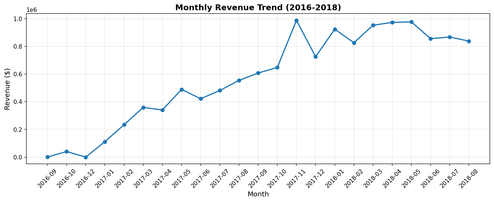
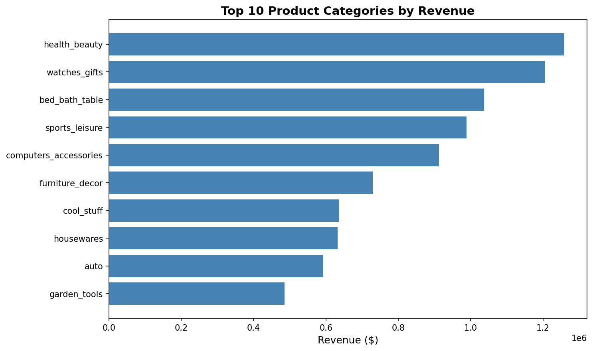
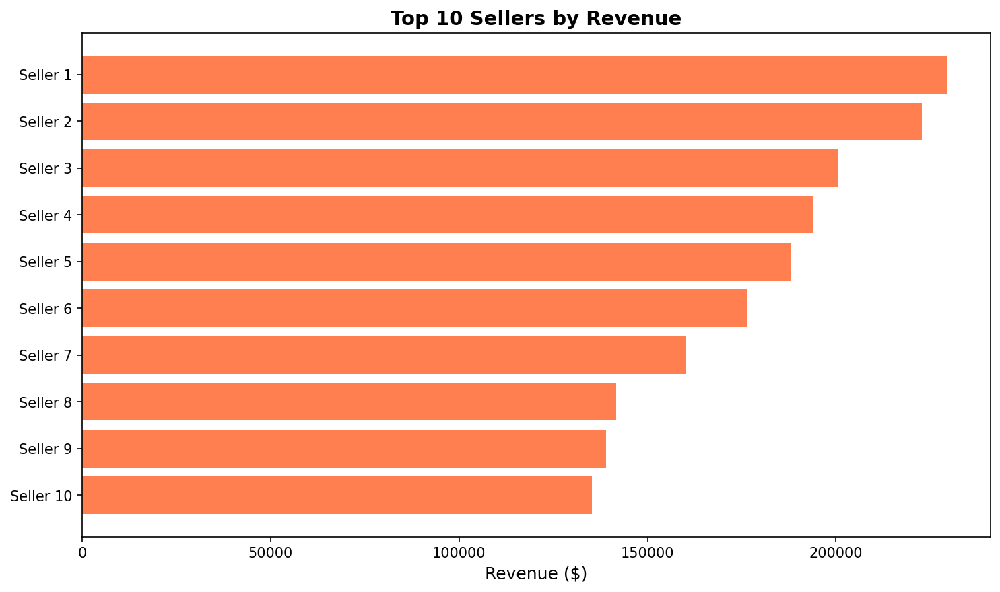

# E-commerce Sales Analytics – Portfolio Project

Business intelligence and SQL analytics project analyzing 2+ years of Brazilian e-commerce data to uncover revenue trends, top-performing products, and seller performance metrics.

## Project Overview

**Goal**: Analyze e-commerce sales data to calculate key business KPIs and visualize insights for data-driven decision-making.

**Dataset**: Brazilian E-Commerce Public Dataset by Olist (Kaggle)
- 99,441 orders from September 2016 to October 2018
- 9 relational tables (orders, customers, products, sellers, payments, reviews, etc.)
- 32,951 products across 71 categories
- 3,095 sellers on the platform

**Tools**: Python, pandas, matplotlib, seaborn, SQL (MySQL)

---

## Key Business Insights

### Revenue Performance
- **Total Revenue**: $15.4M over 2 years ($13.2M products + $2.2M freight)
- **Average Order Value (AOV)**: $159.83
- **Delivered Orders**: 96,478 (97% delivery success rate)
- **Revenue Trend**: Strong upward growth from late 2016 through 2018, with seasonal peaks

### Top Product Categories (by Revenue)
1. Health & Beauty – Highest revenue generator
2. Watches & Gifts
3. Bed, Bath & Table
4. Sports & Leisure
5. Computers & Accessories

### Seller Performance
- Top seller generated **$229,472** in revenue (1.7% of total)
- Top 10 sellers combined: ~$1.8M (~12% of total revenue)
- Revenue is distributed across many sellers (no monopoly)

### Customer Behavior
- **Note**: Repeat purchase rate could not be accurately calculated due to anonymized customer IDs in the dataset (privacy limitation)

---

## Project Structure

Ecommerce_Sales_Analytics/
├── data/
│ └── README.md # Dataset source and download instructions
├── notebooks/
│ └── ecommerce_exploratory_analysis.ipynb # Python analysis with pandas and visualizations
├── sql_queries/
│ └── business_kpis.sql # SQL queries for KPI calculation
├── dashboard/
│ ├── monthly_revenue_trend.png # Revenue growth visualization
│ ├── top_categories.png # Top 10 product categories
│ └── top_sellers.png # Top 10 sellers by revenue
├── .gitignore
├── LICENSE
├── README.md # This file
└── requirements.txt # Python dependencies

---

## Key Performance Indicators (KPIs) Analyzed

### 1. Revenue Metrics
- Total revenue over time
- Monthly revenue trends
- Average order value (AOV)

### 2. Product Analysis
- Top 10 product categories by revenue
- Revenue distribution across categories

### 3. Seller Performance
- Top 10 sellers by revenue
- Seller revenue distribution

### 4. Operational Metrics
- Order status distribution (delivered, shipped, cancelled, etc.)
- Delivery success rate

---

## Visualizations

### Monthly Revenue Trend

Shows clear upward revenue growth from 2016-2018 with seasonal variations.

### Top 10 Product Categories

Health & Beauty leads, followed by Watches & Gifts and home goods categories.

### Top 10 Sellers

Revenue distribution across top-performing sellers on the platform.

---

## SQL Analysis

The project includes SQL queries (`sql_queries/business_kpis.sql`) demonstrating how to calculate these KPIs in a database environment:

1. **Total Revenue and Order Summary** – Aggregated sales metrics
2. **Monthly Revenue Trend** – Time-series revenue analysis
3. **Top Product Categories** – Category-level performance
4. **Top Sellers** – Seller rankings by revenue
5. **Order Status Distribution** – Operational health metrics

---

## How to Reproduce

### Prerequisites
- Python 3.8+
- Jupyter Notebook or JupyterLab
- pandas, matplotlib, seaborn

### Steps

1. **Clone the repository**:
git clone https://github.com/Narges2017/Ecommerce-Sales-Analytics.git
cd Ecommerce-Sales-Analytics

2. **Install dependencies**:

pip install -r requirements.txt

3. **Download the dataset**:
- Go to [Kaggle – Brazilian E-Commerce Dataset](https://www.kaggle.com/datasets/olistbr/brazilian-ecommerce)
- Download all 9 CSV files
- Place them in the `data/` folder

4. **Run the analysis**:

5. **Execute all cells** to reproduce the analysis and regenerate visualizations.

---

## Business Applications

This type of analysis helps e-commerce companies:
- **Track revenue performance** and identify growth trends
- **Optimize product mix** by focusing on high-revenue categories
- **Identify top sellers** for partnership opportunities or promotions
- **Improve operations** by monitoring delivery success rates
- **Make data-driven decisions** about inventory, marketing, and expansion

---

## Results Summary

| Metric | Value |
|--------|-------|
| Total Revenue (2 years) | $15.4M |
| Average Order Value | $159.83 |
| Total Orders Delivered | 96,478 |
| Delivery Success Rate | 97% |
| Top Category | Health & Beauty |
| Top Seller Revenue | $229,473 |
| Revenue Trend | ↗ Strong Growth |

---

## Future Enhancements

- **Interactive Dashboard**: Build a Power BI or Tableau dashboard for real-time KPI monitoring
- **Customer Segmentation**: Cluster analysis to identify customer segments (if repeat purchase data becomes available)
- **Predictive Analytics**: Forecast future sales trends using time series models (ARIMA, Prophet)
- **Review Sentiment Analysis**: NLP on customer reviews to correlate sentiment with sales performance
- **Geographic Analysis**: Map sales by state/city to identify regional opportunities

---

## Author

Narges  
[GitHub](https://github.com/Narges2017) | [LinkedIn](https://www.linkedin.com/in/narges-alyhare)

## License

This project is licensed under the MIT License.
